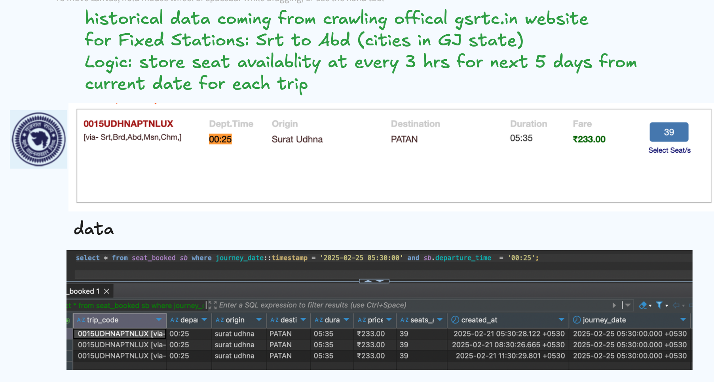
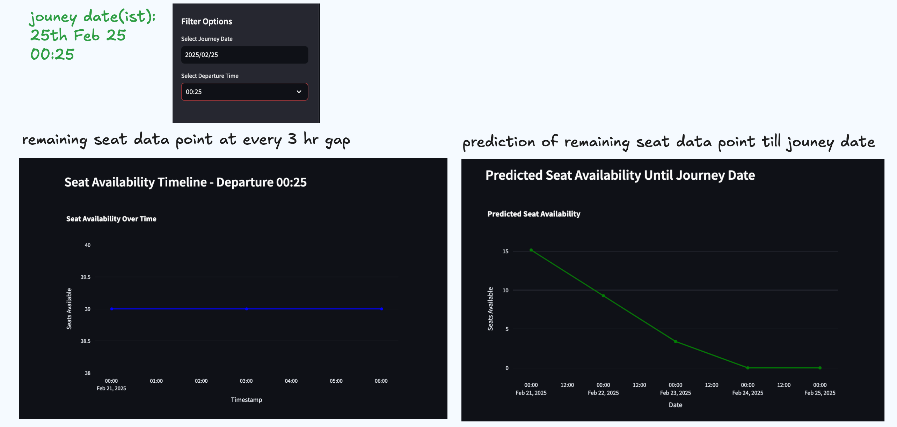

# seat-availability-predictor

Real-time tracking and predictive analytics for bus seat availability using Streamlit and PostgreSQL.

  

A Python-based seat availability predictor using historical data and machine learning algorithms.

  

**Features**

  

 - Predicts seat availability for future dates
 - Uses historical data to train a linear regression model
 - Supports interactive visualization using Streamlit

  

  

**Usage**

  

Clone the repository: `git clone https://github.com/golh30/seat-availability-predictor.git`

Install dependencies: 

    pip install -r requirements.txt

Run the application: `streamlit run main.py`